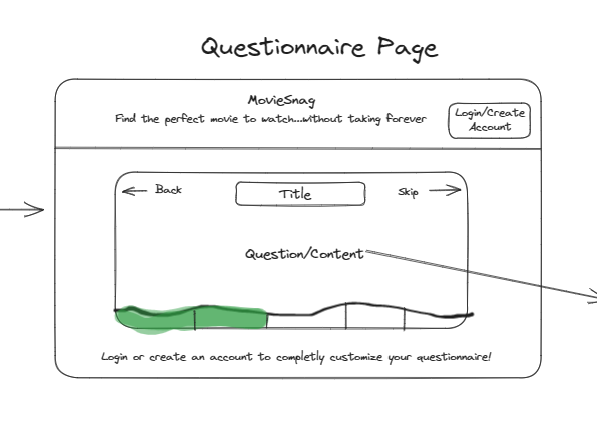
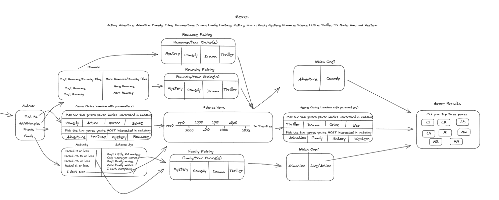
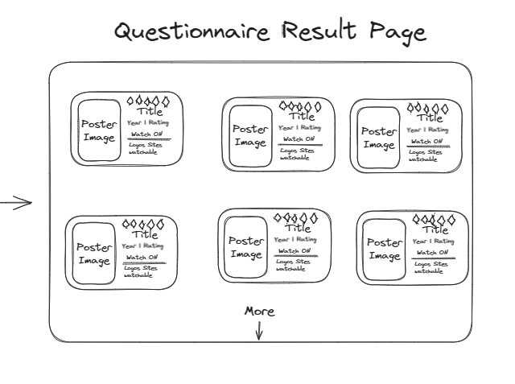

# Overview

MovieSnag is an express.js app that uses ejs for rendering, passport-local to authenticate users, and a postgres database. It is designed to help you choose a movie to pick without endless scrolling, users are given a choice between asnwering a questionaire, and using movieSnag's filters (not built out) to display movie recommendations. The questionaire is 5-6 questions long with different paths based on your answers. The romance path is designed to help users who want to watch romance movies get the best results, the family path (not built out) is similar but for family movies, and the frieds/solo viewer has a basic path that forces him to choose three genres and a release date constraint. Results are displayed in order of popularity. While this repo is cloneable there's no need to install it as the website is available online at:

# Code Snapshots

MovieSnag has its own ejs template class system which helps the questionaire's client-side javascript file work its magic. This is neccesary because the only way for the client-side js file to interact with the server-side ejs file is based on jquery discovered button class clicks to make an AJAX fetch request and insert into the document the response (an ejs template).

These templates have specific class and id values that determine how the js file's logic will handle their buttons being clicked.

- The "choice" button's second class is how many total choices the user must make before progressing to the next page.
- The button's parent's class is how many choices the user must make in that specific div
- The button's parent's, parent's, class is the current card.
- The choice's button's id (exculding the first letter) can be either or both the name of the card that choice should take you to or a displayed genre choice
- The first letter is an optional alteration parameter than removes, adds, or otherwise modifies the selected genre from the user's future/final genre choices.

It's complicated but it makes each template (card) able to have complete functionality all from the below code. Updating the card, altering the genre data, etc is done with switch functions based on the same data. To add more cards you would only have to update the runCard's switch statement with two lines to determine the new Card's sequence in the questionaire.

```javascript
$(document).on("click", ".choice", (event) => {
  event.target.classList.toggle("choiceSelected");
  selectionReq = parseInt(event.target.classList[1]);
  let picked = parseInt(event.target.parentNode.classList[1]);
  selections++; //Total selections on card
  picked--; //An individual div's required selection count left
  //--Update the div's required selection count left
  event.target.parentNode.classList.remove(
    event.target.parentNode.classList[1]
  );
  event.target.parentNode.classList.add(picked.toString());
  //--If picked elment's parent div has met its required selection count
  if (picked === 0) {
    let elements = event.target.parentNode.querySelectorAll("*");
    elements.forEach((element) => {
      element.setAttribute("disabled", "disabled");
    });
  }
  let idArray = event.target.id.split("");
  let [alter, ...id] = idArray;
  //Run the results of a specific selection choice
  runChoice(alter, id.join("").toLowerCase());
  //If all required selections are made go to next card
  if (selections === selectionReq) {
    runCard(
      event.target.parentNode.parentNode.classList[0],
      id.join("").toLowerCase()
    );
  }
});
```

```javascript
let route = `./cards/${newCard.toLowerCase()}.ejs`;
fetch(route)
  .then(function (response) {
    genreResolve(newCard);
    return response.text();
  })
  .then(function (template) {
    let renderedHTML = ejs.render(template, { tempGenres: tempGenres });
    card.innerHTML = renderedHTML;
    questionTitle.textContent = newCard;
  })
  .catch(function (err) {
    console.log("Failed to fetch page: ", err);
  });
```

The function getMovies() is what actually populates the results page with movie recomendations. If the user is logged in it, seenMovieArray will containt a list of movies to exclude becuase the user has already seen them. The query filters and orders them based on popularity and filters them based on the release date, optional animation exclusion/requirement, and genre matching.

```javascript
async function getMovies(seenMovieArray) {
  foundMovies = await movie.findAll({
    where: {
      popularity: {
        [Op.gte]: 20, // Example condition for popularity >= 20
      },
      [Op.or]: [
        sequelize.literal(
          requestParams.genres[0]
            ? `genre_1 IN ('${requestParams.genres.join("','")}')`
            : "TRUE"
        ), //Genre_1 condition (other genres excluded for brevity)
      ],
      [Op.and]: [
        sequelize.literal(`release_date <> ''`), // Exclude empty strings
        sequelize.literal(`release_date IS NOT NULL`), // Exclude null values
        sequelize.literal(
          `CAST(SUBSTRING(release_date, 1, 4) AS INTEGER) > (2023-${requestParams.years})`
        ), // Year condition
        sequelize.literal(
          `CASE WHEN ${requestParams.animation} THEN genre_1 = 'Animation' ELSE TRUE END`
        ), //Animation condition
        sequelize.literal(
          `CASE WHEN ${!requestParams.animation} THEN genre_1 != 'Animation' ELSE TRUE END`
        ), //Animation condition
        sequelize.where(
          sequelize.literal(
            seenMovieArray.length > 0
              ? `title NOT IN ('${seenMovieArray.join("','")}')`
              : "TRUE"
          ),
          true
        ), //Seen Movies condition
      ],
    },
    order: [["popularity", "DESC"]],
  });
  return foundMovies;
}
```

# Database

The database is seeded from data provided by The Movie Database API, and users are able to create accounts that link their preferences/movie's watched, etc, with this data.

## Seeding

Seeding the database is neccesary every so often to ensure movie recommendations are up to data:

- Downloaded TMDB's dailyID export file of every single movie's id to public/data/movie_ids_05_26_2023.json.gz.
- Run src/unzipDailyExports.js which unzippes it to public/data/unzioppedDailyExports.json.
- Run src/processDailyExports.js which parses the json line by line (each line is a vlid JSON object), and maps the id and title into an array.
- In the terminal run `sequelize db:seed:all` which will run the seeder file seedMovieBatch.js. This seeder iterates through the the DailyExport array and requests the full movie details for each movieID from TMDB while following their request rate limiting (45 requests / 1 seconds). After 1,000 movies have been fetched, this batch is mapped to remove undesired entries, insert date creation entries, and adjust some existing entries. This movie batch is then bulkInserted into the database, and a new movie batch begins. It takes approximately 20 seconds to process 1000 movies, or one batch, which at a total of 809,717 movies (movieIds.length) means in theory it will take around 4hrs and 45 minutes to process all of TMDB's data. Realistically it took 24hrs to process half of the data (400,000 movies), reasons unknown but likely network/pc limitations.

## Models

Currently there are three models: movies, users, and usersSeenMovies, a model that defines a many to many relationship between them to track which movies they've marked as seen.

# Testing

Not implemented yet

# Future Updates

- Testing
- Further styling
- Snag Engine filter functionality
- Limited filtering options on questionaire results page
- More functions/capabilities for users
- Import watched list from IMDB

# Web Design

Some excalidraw screenshots of early web design mockups





